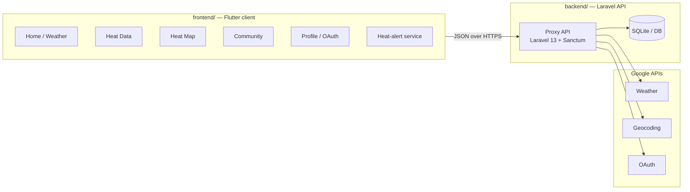

# Nowcast

**A weather and heat-health monitoring app.**

Nowcast helps you keep an eye on current weather conditions, extreme-heat risk in your area, and location-tagged updates from other users. It combines:

- **Live weather & forecast** for your current location
- **A heat-index chart** showing how temperature, humidity, and related factors evolve over the next few hours
- **An interactive map** of crowd-sourced heat-index readings near you
- **A community feed** where signed-in users can post short updates, optionally tagged with their location
- **Heat alerts** — a background service that notifies you when the heat index crosses a danger threshold you set

This repository is a monorepo containing both the Flutter client and its Laravel backend.

---

## Architecture

The project is split into two components that talk over a JSON API:



- **`frontend/`** — a [Flutter](https://flutter.dev/) client (Android, iOS, and web/PWA). It provides a five-tab interface (Home, Heat Data, Map, Community, Profile) plus a background notification service for heat alerts.
- **`backend/`** — a headless JSON API built with **Laravel 13 + Sanctum**. It proxies Google Weather, Geocoding, and OAuth, and persists users, posts, and crowd-sourced heat-index readings. The backend owns all Google credentials; the client never holds them.

---

## Features

- **Weather** — current conditions, a 6-hour forecast, and reverse-geocoded location for your area.
- **Heat Data** — a line chart comparing temperature, feels-like, dew point, heat index, wind chill, and wet-bulb temperature over the next few hours.
- **Heat Map** — an interactive map of crowd-sourced heat-index readings, with colored markers from mild to extreme. Tap any spot to request a reading for that exact location.
- **Community** — a public, time-limited (24 h) feed of short posts with author avatars and optional location tags.
- **Heat alerts** — an optional background service that shows a persistent notification and alerts you when the heat index crosses your chosen threshold.
- **Google sign-in** — server-side OAuth via the backend; the resulting Sanctum token is delivered back to the app through a `nowcast://auth` deep link.

---

## Getting Started

### Prerequisites

- **Backend:** PHP **^8.3**, [Composer](https://getcomposer.org/), Node.js + npm
- **Frontend:** Flutter SDK (Dart SDK **^3.12.2**)

### Backend

```bash
cd backend
composer install
cp .env.example .env          # fill in Google credentials (see below)
php artisan key:generate
php artisan migrate
```

> A convenience `composer run setup` performs install, env copy, key generation, migration, and the frontend asset build in one step.

Start the dev server (server + queue worker + Vite concurrently):

```bash
composer run dev
```

See [`backend/README.md`](backend/README.md) for full setup, configuration, and API details.

### Frontend

```bash
cd frontend
flutter pub get
flutter run -d android        # or -d ios, or a web target
```

The app is configured at build time via `--dart-define` flags (see below). See [`frontend/README.md`](frontend/README.md) for the complete run commands and per-platform notes.

---

## Configuration

### Backend environment variables

Copy `.env.example` to `.env` and fill in the Google credentials:

| Variable | Description |
|---|---|
| `GOOGLE_API_KEY` | Google Weather / Geocoding API key |
| `GOOGLE_CLIENT_ID` | Google OAuth client ID |
| `GOOGLE_CLIENT_SECRET` | Google OAuth client secret |
| `GOOGLE_REDIRECT_URI` | OAuth redirect URI (web page URL or native custom scheme / universal link) |
| `GOOGLE_NATIVE_SCHEME` | Native custom scheme for OAuth deep links (default: `nowcast`) |

### Frontend build-time flags

| Flag | Default | Purpose |
|---|---|---|
| `API_BASE_URL` | `http://localhost:8000/api` | Absolute base URL of the Laravel proxy API |
| `GOOGLE_MAPS_CLIENT_KEY` | *(none)* | Client Google Maps API key for the Map tab |

Example (pointing at a local dev server on the Android emulator):

```bash
flutter run --dart-define=API_BASE_URL=http://10.0.2.2:8000/api
```

> The Maps key is a build-time **client** key, distinct from the server's `GOOGLE_API_KEY`, which must never be compiled into the app.

---

## Testing

```bash
# Backend (Pest)
cd backend && composer run test

# Frontend
cd frontend && flutter test
```

---

## Project Structure

```
nowcast/
├── backend/                 # Laravel 13 + Sanctum headless JSON API
│   ├── app/
│   │   ├── Http/Controllers/   # Weather, HeatLocation, Post, Auth, GoogleOAuth
│   │   ├── Models/             # User, Post, HeatLocation
│   │   └── Services/           # GoogleWeatherService, GoogleOAuthService
│   ├── database/
│   │   ├── migrations/         # users, posts, heat_locations, tokens, queue, cache
│   │   └── seeders/
│   ├── routes/api.php          # All API endpoints
│   └── docs/api-docs.md        # Authoritative API reference
│
└── frontend/                # Flutter client (Android, iOS, web/PWA)
    ├── lib/
    │   ├── main.dart           # App entry point
    │   └── src/
    │       ├── api/            # ApiClient (HTTP against the Laravel proxy)
    │       ├── auth/           # AuthController (Google OAuth + token persistence)
    │       ├── config/         # AppConfig, MapsConfig (build-time configuration)
    │       ├── models/         # Weather, ForecastHour, HeatLocation, Post, User
    │       ├── screens/        # Home, Heat Data, Map, Community, Profile + post screens
    │       ├── services/       # Heat-alert background service + controller
    │       ├── shell/          # AppShell (bottom navigation + IndexedStack)
    │       ├── theme/          # AppTheme
    │       ├── utils/          # Geolocation, formatting, heat colors, etc.
    │       └── widgets/        # Reusable UI widgets
    └── test/                   # Flutter test suite
```

---

## Documentation

- [`backend/docs/api-docs.md`](backend/docs/api-docs.md) — authoritative reference for the backend API contract.
- [`backend/docs/endpoint-responses.md`](backend/docs/endpoint-responses.md) — real Google payload examples.
- [`frontend/docs/commands.md`](frontend/docs/commands.md) — frontend run commands.
- [`frontend/docs/endpoint-responses.md`](frontend/docs/endpoint-responses.md) — example endpoint responses.

---

## License

This project is open-sourced software licensed under the [MIT license](https://opensource.org/licenses/MIT).
